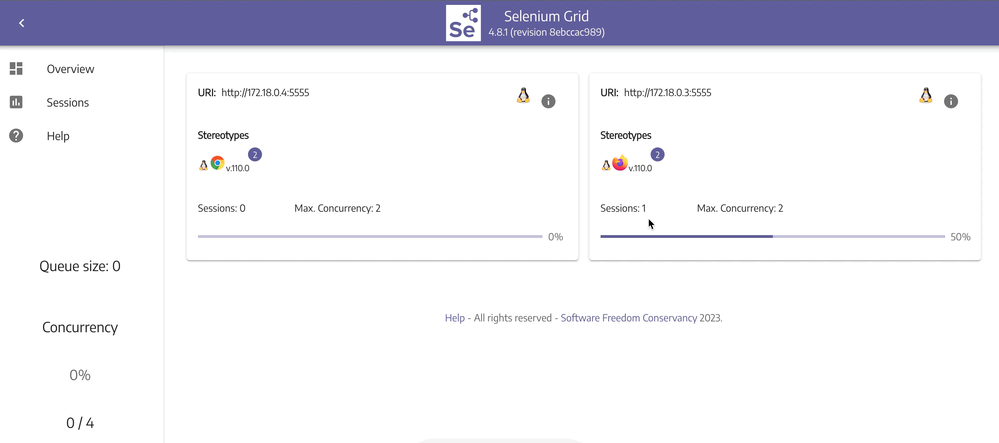

# Selenium distributed and parallelized tests with Python And Selenoid or Selenium Grid

In this project I demonstrate how to use Python with Pytest, Selenium and Selenoid or Selenium Grid for automation E2E tests parallelized or distributed.

The tests code is simple,for that reason I don't use PageObject, abstraction and others design patterns, the objective this project is show a configuration of Pytest and Selenoid for execution tests in distributed an parallelized ways.

I suggest using Selenoid instead of Selenium Grid, the selenium grid is heavy and slow, in addition there are other aspects that make the choice of Selenoid [click here to see](https://blog.aerokube.com/selenium-grid-4-do-you-really-need-it-ab03366625b0)

This project includes:

- Frameworks:
    - Pystest
    - Allure
    - Selenium 4


- Features:
    - Distributed tests over different browsers
    - Parallelized tests
    - Screenshot on fail testes
    - Remove vitalization with Selenoid UI ou Selenium Grid 4
    - Record video opf tests
    - Pytest fixtures and parametrize
    - Use docker for infrastructure
    - Report with Allure
    
## Demo App
For these tests I use a Sauce Labs demo app which can be found here: [Sauce Demo](https://www.saucedemo.com/)

## Requirements
- Python >= 3.9 - [How install Python](https://www.python.org/downloads/)
- Pip >= 21.3.x - [How install pip](https://pip.pypa.io/en/stable/installing/)
- Docker >= 23.0 - [How install Docker](https://docs.docker.com/get-docker/)
- Allure Cliente >= 2.21 [How install allure client](https://docs.qameta.io/allure/#_commandline)

## Getting Started
Install dependencies:

```bash
$ pip3 install --no-cache-dir -r requirements.txt
```

## Start Selenoid Server:
```bash
$ docker-compose up
```
##OR

## Start Selenium Grid Server:
```bash
$ docker-compose -f docker-compose-selenium-grid.yml up
````

## Selenoid or Selenium grid UI:

After started the Selenoid or Selenium Grid service, it is possible to manage and view the test sections, just access the address in the browser:
> Selenoid: http://localhost:8080/#/


> Selenium Grid: http://localhost:4444/



## To run tests in Chrome and Firefox Browser:
```bash
$ pytest -vv -q --browser_name="chrome" -q --browser_name="firefox" --alluredir=results/allure_report
```

## To run tests in Chrome Browser:
```bash
$ pytest -vv -q --browser_name="chrome" --alluredir=results/allure_report
```

## To run tests in Firefox Browser:
```bash
$ pytest -vv -q --browser_name="firefox" --alluredir=results/allure_report
```

## To run tests in local Chrome Browser:
```bash
$ pytest -vv -q --browser_name="local" --alluredir=results/allure_report
```

## To run tests in parallel mode:
To run more than one test simultaneously, just add the **-n** parameter informing the maximum number of tests to be run simultaneously, the maximum possible number is limited by the number of threads that the processor has to run the tests.
For example to run 2 tests at the same time:
```bash
$ pytest -n2 -vv -q --browser_name="firefox" --alluredir=results/allure_report
```

## Enabling video record (Run only in selenoid):
In conftest.py change de value of enableVideo to True, after running the tests, the videos will be stored in the results/video folder:
```python
selenoid_options = {"enableVNC": True,
                        "enableVideo": True,
                        "videoName": f'{request.node.nodeid}.mp4',
                        "videoCodec": "mpeg4",
                        "enableLog": False}
```
## Add more versions or browser in Selenoid:
> To add new browsers, just change the browsers.json file, you also need to add the browsers image at the end of the docker-compose.yml file, this page has more information [Browsers Configuration File](https://github.com/aerokube/selenoid/blob/master/docs/browsers-configuration-file.adoc)

## Reports
> You must have the allure client installed

Run the command below to generate the test report:

```bash
$ allure generate --clean results/allure_report -o results/allure_result 
```

To view the report in the browser:

```bash
$ allure open results/allure_result
```

